<a href="https://poutoo.dev">
  <picture>
    <source media="(prefers-color-scheme: dark)" srcset="./assets/sky-dark.svg">
    
  </picture>
</a>

| Star | Project | Stack |
|---|---|---|
| ✦ [**Canopus**](https://github.com/Poutoo/Canopus) | Windows game optimizer, work in progress | WinUI 3, .NET 8 |
| ✦ [**Vega**](https://github.com/Poutoo/Vega) | Universal CLI video and music downloader | |

<b>Tech stack</b>

 

**Frontend & Design** 

**Backend & Languages** 

**Database & Automation** 

**Tools & DevOps** 

**Currently learning** 

